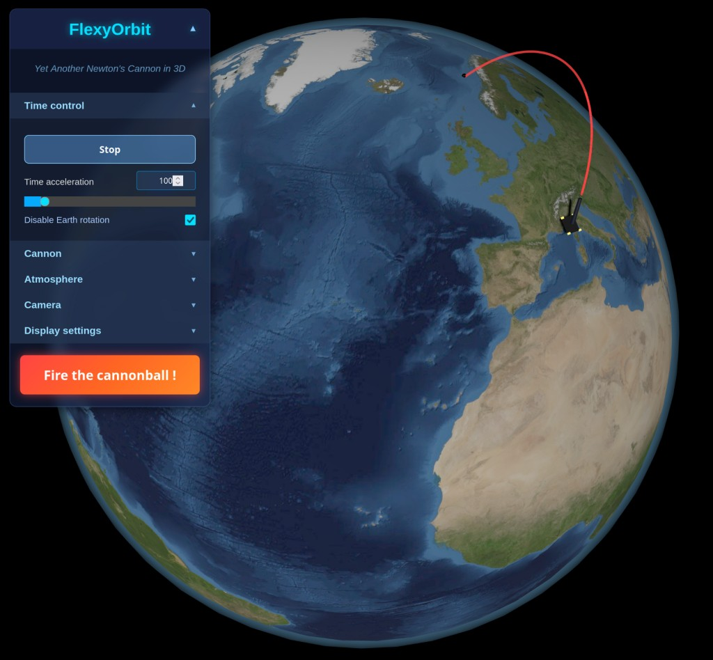

# FlexyOrbit

**Yet Another Newton's Cannon in 3D**  
FlexyOrbit is a small educational project to play with Earth's gravity and orbital mechanics.

  

The idea for this project came after discovering the beautiful interactive simulations by **[ScienceÉtonnante](https://www.youtube.com/@ScienceEtonnante)**, especially [the famous Newton's Cannon one](https://explorables.scienceetonnante.com/newton-cannon/).

## Controls

You can tweak every parameter using the HTML interface widgets, **but you can also interact directly with the cannon**:

### Mouse controls on the cannon
- **Left click + drag** → move cannon position on Earth's surface (latitude/longitude)
- **Right click + horizontal drag** → change cannon azimuth (horizontal orientation)
- **Left click + Ctrl + vertical drag** → adjust cannon altitude
- **Left click + Shift + vertical drag** → change cannon elevation (launch angle)

### Keyboard shortcuts
- **Space** → fire the cannonball
- **C** → switch camera mode
- **T** → switch camera target

### Camera modes
- **OrbitControls / MapControls**  
  Left click + drag to rotate around Earth, mouse wheel to zoom
- **FlyControls (FPS style)**  
  QZSD (or WSAD on AZERTY) to move, mouse to look around  
  **R** / **F** → move up / down  
  **Q** / **E** (or **A** / **E** on AZERTY) → roll the camera

## About Earth textures

By default FlexyOrbit uses a beautiful **5K Blue Marble** texture from NASA's project.

For better quality, performance, and especially to avoid CORS issues, I strongly recommend **downloading and hosting the texture locally**. Here are some great options:

| Resolution | Link                                                                                  | Notes                                 |
|------------|---------------------------------------------------------------------------------------|---------------------------------------|
| 4K         | https://unpkg.com/three-globe/example/img/earth-blue-marble.jpg                      | Fast & good quality                   |
| 5K         | https://sbcode.net/topoearth/blue-marble-texture-5400x2700/                          | Nice balance quality/size             |
| 8K         | https://www.solarsystemscope.com/textures/download/8k_earth_daymap.jpg               | Very detailed                         |
| 16K        | https://sbcode.net/topoearth/blue-marble-texture-21600x10800/ (tiles to merge)       | Ultra-high detail                     |
| 21K        | https://sgr_a.artstation.com/store/5oNl/solar-system-in-16k-texture-pack             | Ultra-high detail                     |

On my local setup I downloaded tiles from 21K BlueMarble from Sean Bradley website (https://sbcode.net/topoearth/blue-marble-texture-21600x10800/), merged them into an unique image and then reized it into a 16K image. 
Why in 16K ? Because most of WebGL renderers fixe a size limit of 8K, or 16K in the better case for high end graphic cards.

## Acknowledgments

Big thanks to:
- **[Three.js](https://threejs.org/)** — the amazing JavaScript library that makes 3D in the browser enjoyable
- **[Grok](https://grok.x.ai)** — who helped me a lot writing and debugging the code
- **[Isaac Newton](https://en.wikipedia.org/wiki/Isaac_Newton)** — the first person to realize the Moon is constantly falling 😉
