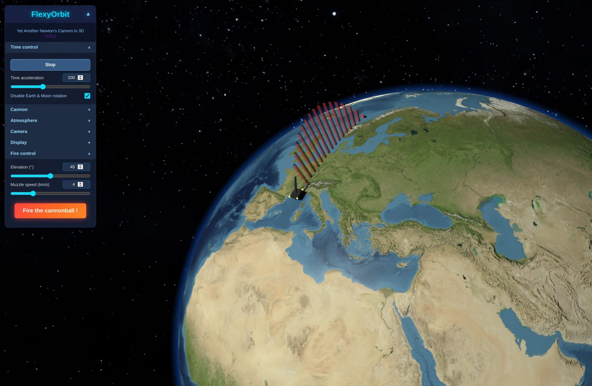

# FlexyOrbit

**Yet Another Newton's Cannon in 3D**  
FlexyOrbit is a small educational project to play with Earth's gravity and orbital mechanics.

  

The idea for this project came after discovering the beautiful interactive simulations by **[ScienceÉtonnante](https://www.youtube.com/@ScienceEtonnante)**, especially [the famous Newton's Cannon one](https://explorables.scienceetonnante.com/newton-cannon/).

## Controls

### Camera

#### Target switching

You can select the camera target from the interface or use one of these keyboard shortcuts :

- **T** → switch camera target to next object
- **R** → switch camera target to previous object
- **E** → switch camera target to the Earth (default)
- **C** → switch camera target between cannon and cannonballs
- **S** → switch camera target between satellites and spaceships
- **M** → switch camera target to the Moon

#### Camera modes

You can select the camera target from the interface or use press the key **V** to switch camera mode. Currently there are **orbit controls** (default) and **fly controls** (BETA)

OrbitControls :
- Left click + drag to rotate around Earth
- Mouse wheel to zoom

FlyControls :
- **WSAD** (or **QZSD** on AZERTY keyboards) → move the camera (move mouse to look around)
- **R** / **F** → move up / down  
  **Q** / **E** (or **A** / **E** on AZERTY keyboards) → roll the camera

### Cannon

You can tweak every parameter using the HTML interface widgets, but you can also interact directly with the cannon by clicking and dragging directly the cannon:
- **Left click + drag** → move cannon position on Earth's surface (latitude/longitude)
- **Right click + horizontal drag** → change cannon azimuth (horizontal orientation)
- **Left click + Ctrl + vertical drag** → adjust cannon altitude
- **Left click + Shift + vertical drag** → change cannon elevation (launch angle)

- **Space** → fire the cannonball

### Spaceships

You can tweak every parameter using the HTML interface widgets, or use keyboard shortcuts:
- **4/6** → Rotate selected spaceship on the yaw axis
- **5/8** → Rotate selected spaceship on the pitch axis
- **7/9** → Rotate selected spaceship on the roll axis
- **Enter** → Activate main engine (forward thrust)
- **0** → Activate main engine (backward thrust)

## Credits

### 3D models

- Spaceship model is coming from : https://sketchfab.com/3d-models/spaceship-low-poly-8a3674c37d4c4afa9326f9c7ab0f90bf

- ISS model is coming from :
https://sketchfab.com/3d-models/iss-international-space-station-33c72dd6671c40b3ae5bf90c917a6adb
https://sketchfab.com/3d-models/iss-813f5b296e584c26bf386ca39de6c3d4

Thanks a lot to these creators !

### Textures

By default FlexyOrbit uses a beautiful **5K Blue Marble** from NASA's project as the main Earth texture.

For better quality, performance, and especially to avoid CORS issues, I strongly recommend downloading and hosting the texture locally. Here are some great options:

| Resolution | Link                                                                                  | Notes                                 |
|------------|---------------------------------------------------------------------------------------|---------------------------------------|
| 4K         | https://unpkg.com/three-globe/example/img/earth-blue-marble.jpg                      | Fast & good quality                   |
| 5K         | https://sbcode.net/topoearth/blue-marble-texture-5400x2700/                          | Nice balance quality/size             |
| 8K         | https://www.solarsystemscope.com/textures/download/8k_earth_daymap.jpg               | Very detailed                         |
| 16K        | https://sbcode.net/topoearth/blue-marble-texture-21600x10800/ (tiles to merge)       | Ultra-high detail                     |
| 16K        | https://sgr_a.artstation.com/store/5oNl/solar-system-in-16k-texture-pack             | Ultra-high detail                     |

On my local setup I downloaded tiles from 21K BlueMarble from Sean Bradley website (https://sbcode.net/topoearth/blue-marble-texture-21600x10800/), merged them into an unique image and then reized it into a 16K image. Why in 16K ? Because most of WebGL renderers fixe a size limit of 8K, or 16K in the better case for high end graphic cards.

## Acknowledgments

Big thanks to:
- **[Three.js](https://threejs.org/)** — the amazing JavaScript library that makes 3D in the browser enjoyable
- **[Grok](https://grok.x.ai)** — who helped me a lot writing and debugging the code
- **[Isaac Newton](https://en.wikipedia.org/wiki/Isaac_Newton)** — the first person to realize the Moon is constantly falling 😉
